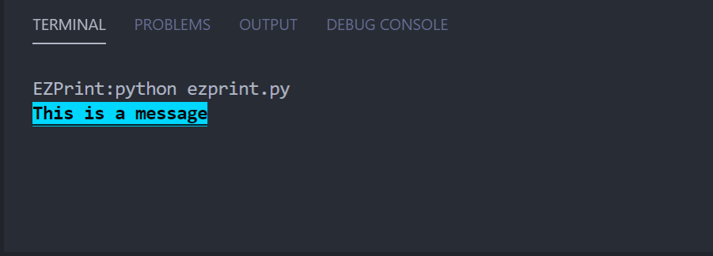

# EZPrint

## What is EZPrint?
EZPrint is a module built for printing  fancy-dancy neat text to the console, terminal, you name it. 

## Usage
```python
# Color print with a black font and blue background
cprint("This is a message", fcolor=1, bcolor=118, bold=True, underline=True)
```
### output
